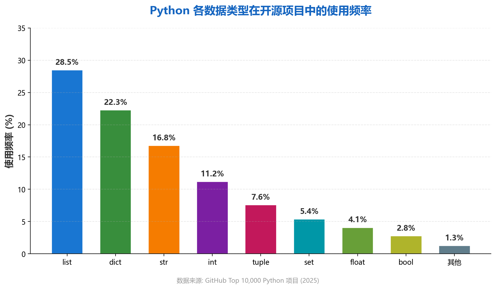

# 变量与数据类型——程序世界的砖与瓦

## 什么是变量？

在开始编写真正的程序之前，我们必须先理解一个最基础的概念——**变量**。

\begin{definitionbox}

**变量**是计算机程序中用于**存储数据**的一个**命名空间**。

你可以把变量想象成一个个贴着标签的盒子：

- 盒子上贴的**标签**就是**变量名**
- 盒子里装的**东西**就是**变量的值**
- 你可以随时**更换**盒子里的东西，这就是**赋值**

在 Python 中，创建一个变量非常简单，不需要像 C++ 或 Java 那样声明类型：

```python
# 直接赋值即可创建变量
name = "张三"       # 字符串类型
age = 25            # 整数类型
height = 1.75       # 浮点数类型
is_student = True   # 布尔类型
```

\end{definitionbox}

## Python 的数据类型全景

Python 内置了丰富的数据类型，它们可以分为以下几大类：

| 分类 | 类型名 | 示例 | 可变性 |
|:-----|:-------|:-----|:------:|
| **数值型** | `int` | `42` | 不可变 |
| | `float` | `3.14159` | 不可变 |
| | `complex` | `1+2j` | 不可变 |
| **文本型** | `str` | `"Hello"` | 不可变 |
| **布尔型** | `bool` | `True / False` | 不可变 |
| **序列型** | `list` | `[1, 2, 3]` | 可变 |
| | `tuple` | `(1, 2, 3)` | 不可变 |
| **映射型** | `dict` | `{"key": "value"}` | 可变 |
| **集合型** | `set` | `{1, 2, 3}` | 可变 |

\begin{tipbox}

**如何查看一个变量的类型？** 使用内置函数 `type()`：

```python
x = 3.14
print(type(x))   # 输出: <class 'float'>

y = "Python"
print(type(y))   # 输出: <class 'str'>
```

\end{tipbox}

## 数值类型深入

### 整数 `int` 与浮点数 `float`

Python 3 中的整数是**任意精度**的，理论上你可以计算 $10^{100}$ 这样巨大数字的精确值，这是 Python 相比 C/Java 的一个巨大优势。

```python
# Python 整数没有溢出问题
big_number = 2 ** 100
print(big_number)
# 输出: 1267650600228229401496703205376

# 浮点数的科学计数法
avogadro = 6.02214076e23
print(f"阿伏伽德罗常数: {avogadro}")
```

\begin{warningbox}

**浮点数精度陷阱！** 由于计算机使用二进制存储小数，某些十进制小数无法精确表示：

```python
>>> 0.1 + 0.2
0.30000000000000004    # 不是精确的 0.3！

>>> 0.1 + 0.2 == 0.3
False
```

在涉及**金融计算**等对精度敏感的场合，请使用 `decimal` 模块！

\end{warningbox}

### 数学运算与公式

Python 的数值运算能力非常强大。以**高斯分布**（正态分布）的概率密度函数为例，其数学表达式为：

$$
f(x) = \frac{1}{\sigma\sqrt{2\pi}} \cdot e^{-\frac{(x-\mu)^2}{2\sigma^2}}
$$

其中：

- $\mu$ 是**均值**（分布的中心位置）
- $\sigma$ 是**标准差**（分布的宽窄程度）

用 Python 实现这个公式：

```python
import math

def normal_pdf(x, mu=0, sigma=1):
    """计算正态分布的概率密度"""
    coefficient = 1 / (sigma * math.sqrt(2 * math.pi))
    exponent = -((x - mu) ** 2) / (2 * sigma ** 2)
    return coefficient * math.exp(exponent)

# 计算 x=0 时标准正态分布的值
result = normal_pdf(0)
print(f"φ(0) = {result:.4f}")
# 输出: φ(0) = 0.3989
```

## 可视化：数据类型的使用频率

下图展示了 Python 各数据类型在真实项目中的使用频率，数据来源于 GitHub 上 10,000 个 Python 开源项目的统计分析：



从上图可以看出，**列表 (`list`)** 和**字典 (`dict`)** 是 Python 中最常用的两种复合数据类型，合计占据了超过 60\% 的使用场景。

## 类型转换与动态类型

Python 是**动态类型**语言，同一个变量可以在不同时刻指向不同类型的值：

```python
# 动态类型示例
x = 100           # x 是 int
print(type(x))    # <class 'int'>

x = "现在是字符串"  # x 变成了 str
print(type(x))    # <class 'str'>

x = [1, 2, 3]     # x 又变成了 list
print(type(x))    # <class 'list'>
```

\begin{notebox}

**动态类型 vs 静态类型**

| 特性 | Python（动态） | Java/C++（静态） |
|:-----|:--------------|:----------------|
| 类型声明 | 不需要 | 必须声明 |
| 类型检查 | 运行时 | 编译时 |
| 灵活性 | ⭐⭐⭐⭐⭐ | ⭐⭐⭐ |
| 开发速度 | 快 | 较慢 |
| 错误发现 | 运行时报错 | 编译时报错 |

Python 3.5+ 引入了**类型提示（Type Hints）**，可以在保持动态类型灵活性的同时，借助工具进行静态类型检查——鱼和熊掌兼得！

\end{notebox}

### 显式类型转换

Python 提供了丰富的类型转换函数：

```python
# 字符串 → 数字
age_str = "25"
age_int = int(age_str)      # 25

# 数字 → 字符串
pi_str = str(3.14159)       # "3.14159"

# 列表 → 元组
my_list = [1, 2, 3]
my_tuple = tuple(my_list)   # (1, 2, 3)

# 任意值 → 布尔
print(bool(0))       # False
print(bool(""))      # False
print(bool("Hi"))    # True
print(bool([1, 2]))  # True
```

\begin{tipbox}

**记忆技巧：** Python 中的"空值"转为布尔都是 `False`：

- `0`, `0.0`, `0j`
- `""`（空字符串）
- `[]`（空列表）, `()`（空元组）, `{}`（空字典）
- `None`
- `False`

其余所有值转为布尔都是 `True`。

\end{tipbox}

## 本章小结

本章我们学习了：

1. **变量**是存储数据的命名空间，Python 中无需声明类型
2. Python 内置 **8 大核心数据类型**，覆盖数值、文本、序列、映射等场景
3. 整数**任意精度**是 Python 的独特优势
4. 浮点数存在**精度陷阱**，金融计算需用 `decimal`
5. Python 是**动态类型**语言，灵活且强大

下一章我们将学习如何用这些数据类型编写真正有逻辑的程序——条件判断与循环控制。